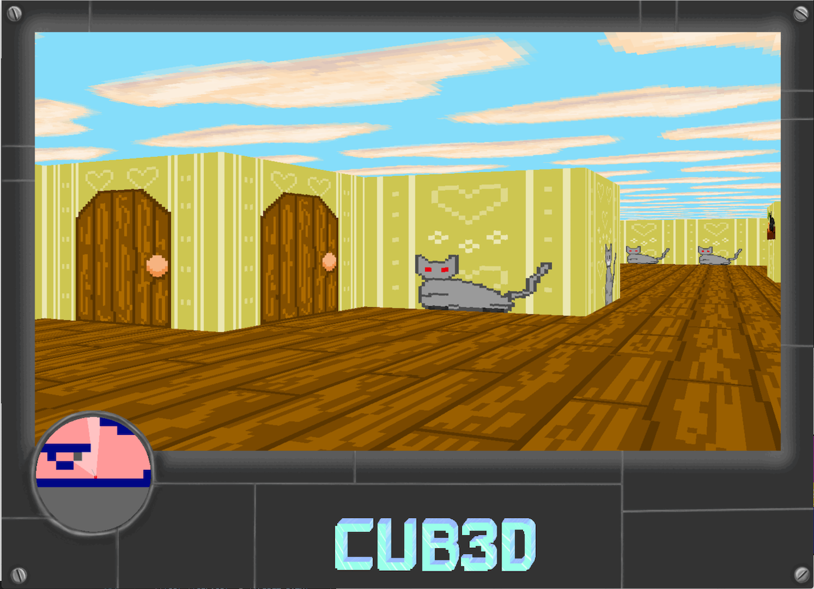

# cub3D

## Collaborators

[Jenny Boucher](https://github.com/jboucher154)

[Thuy Linh Nguyen](https://github.com/linhtng)

## Description

cub3D is a walking simulator that uses ray-casting similar to Wolfensterin 3D. This project was completed as part of the 42-School Core Curriculum. We chose to keep a cute pixel quality to the images and created some of our own textures to use.

### Technologies

cub3D is written in C and uses MiniLibX, a small graphics library maintained by 42-School network.

### Focus of Project

- Use of C
- Using basic algorithms (flood-fill, DDA)
- Working with minimal graphics library
- Rigor
- Working in team

## Features

### Mandatory Part:

- Parsing map files
- Map validation
- Rendering and walking through raycast maze
- Collision detection
  

### Bonus Part:

- Minimap system
- Rotate view with mouse
- Raycast floor and ceiling
- Animated ceiling
- Doors that can be opened and closed

## How to Use

### Requirements

/* Project is currenlty being updated to work with M1 processor and key codes and cannot be used currently unless you have a system installation of minilibx and your system has linux key codes */

You will need a gcc compiler and the [minilibx library](https://github.com/42Paris/minilibx-linux)

## Controls

| __Key__        | __Action__   |
| -------------  |:-------------:|
| W              | Move forward |
| A       | Move left      |
| D  | Move right      |
| S  | Move backwards      |
| Left Arrow  | Turn Left      |
| Right Arrow  | Turn Right      |
| Space  | Open/ Close doors      |
| Mouse  | Turn      |
| ESC  | Close window      |
  

System Compatibility:

These hard-coded key codes have been designed to work within the context of a specific graphics program. They are mapped as follows:

- 'w' = 13
- 's' = 1
- 'a' = 0
- 'd' = 2
- 'esc' = 53
- 'left arrow' = 123
- 'right arrow' = 124
